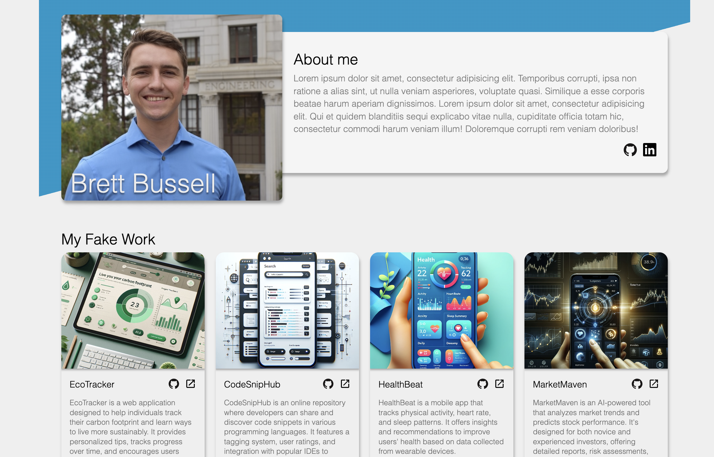
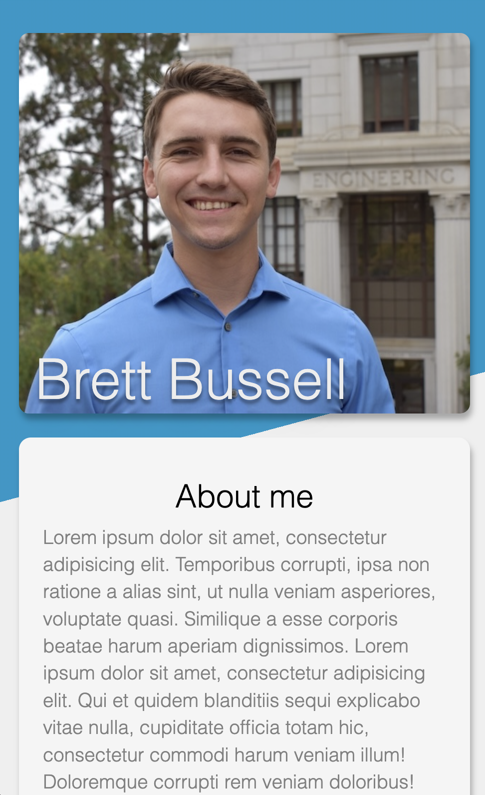
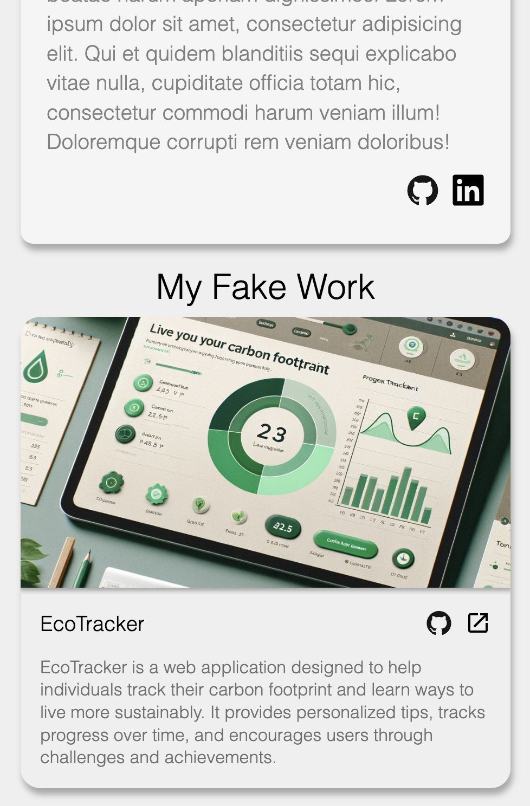

# Responsive Homepage

This project is a responsive personal portfolio home page.

## Description

This is a responsive homepage designed to showcase a portfolio. It includes a header with a headshot and an "About Me" section, dynamically loaded project cards, and custom styles.

## Table of Contents

- [Description](#description)
- [Screenshot](#screenshot)
- [Preview](#preview)
- [Features and Implementation](#features-and-implementation)
- [Installation](#installation)
- [Usage](#usage)
- [Tech Stack](#tech-stack)
- [License](#license)
- [Contact Information](#contact-information)

## Screenshot

### Wide View



### Narrow View

<div style="display: flex; gap: 40px;">
    
    
</div>

## Preview

You can view a live preview of the page [here](https://sourdoughbredd.github.io/responsive-homepage/).

## Features and Implementation

- **Header Section**: Includes a headshot, name, and "About Me" section.
- **Project Cards**: Dynamically loaded project cards with details such as name, description, GitHub link, and external link.
- **Responsive Design**: Ensures the webpage looks good on various devices using custom CSS and a CSS reset.

## Installation

1. Clone the repository:
   ```sh
   git clone https://github.com/sourdoughbredd/responsive-homepage.git
   ```
2. Navigate to the project directory:
   ```sh
   cd responsive-homepage
   ```
3. Install dependencies:
   ```sh
   npm install
   ```
4. Build the project:
   ```sh
   npm run build
   ```
5. Open `dist/index.html` in your preferred web browser.

## Usage

Simply open `index.html` in a web browser to view the responsive homepage.

## Tech Stack

- HTML
- CSS (CSS Modules)
- JavaScript

## License

This project is licensed under the MIT License.

## Contact Information

For any questions or suggestions, please contact Brett Bussell at [bwbussell24@gmail.com](mailto:bwbussell24@gmail.com).
